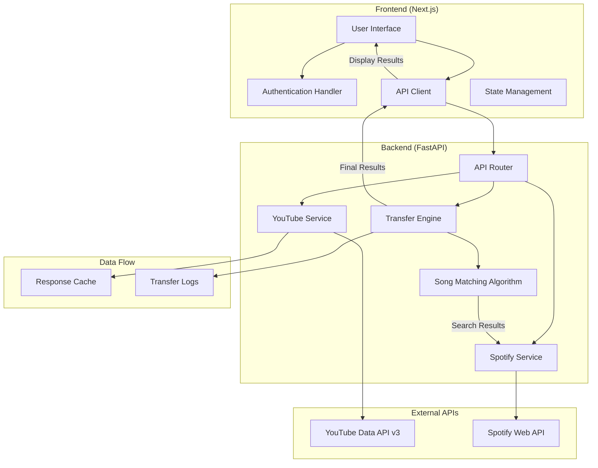
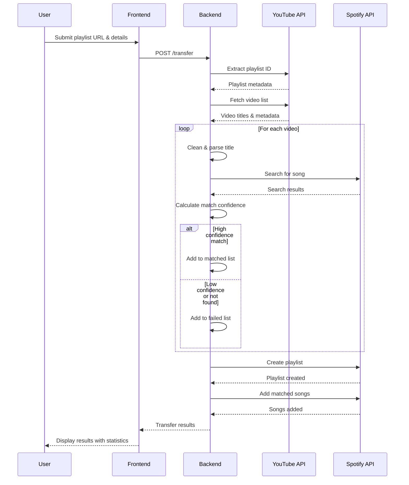

# FloTunes

A production-ready full-stack application for seamlessly transferring YouTube playlists to Spotify with intelligent song matching and comprehensive transfer analytics.


## System Architecture



**Flow Process:**
+ **User interaction** starts at the frontend UI, which handles authentication and communicates with the backend
+ **Backend API Router** receives requests and coordinates between YouTube, Spotify, and Transfer services
+ **External APIs** (YouTube Data API v3 and Spotify Web API) provide the core data and functionality
+ **Transfer Engine** orchestrates the entire process, using the Song Matching Algorithm for intelligent pairing
+ **Data persistence** happens through response caching and comprehensive transfer logging
+ **Results flow back** through the API client to display rich analytics and transfer status to users

## Transfer Sequence Diagram.



**Flow:**
+ **User initiates transfer** by submitting YouTube playlist URL and desired Spotify playlist settings
+ **Backend extracts playlist data** from YouTube API, including video metadata, titles, and thumbnails
+ **Intelligent song matching** processes each video through multiple search strategies and confidence scoring
+ **Dual-path processing** separates successfully matched songs from failed matches with detailed error tracking
+ **Spotify playlist creation** and bulk song addition happens efficiently using batch operations
+ **Comprehensive results delivery** includes transfer statistics, individual song status, and performance metrics

------


## Project Structure

```
FloTunes/
FloTunes/
├── backend/
│   ├── api/
│   │   └── transfer.py              # API route handlers
│   ├── services/
│   │   ├── youtube_api.py           # YouTube API integration
│   │   ├── spotify_api.py           # Spotify API integration
│   │   └── transfer_api.py          # Transfer orchestration
│   ├── models/
│   │   └── transfer.py              # Pydantic models
│   ├── credentials/                 # API credentials (gitignored)
│   ├── cache/                       # API response cache
│   └── main.py                      # FastAPI application
├── frontend/
│   ├── app/
│   │   ├── page.tsx                 # Home page
│   │   ├── layout.tsx               # Root layout
│   │   └── get-started/
│   │       └── page.tsx             # Transfer flow page
│   ├── components/
│   │   ├── get-started/             # Transfer flow components
│   │   └── ui/                      # Reusable UI components
│   ├── utils/
│   │   └── api_routes/
│   │       └── api.ts               # API client configuration
│   └── types/
│       └── index.ts                 # TypeScript type definitions
├── .gitignore
├── README.md
└── requirements.txt
```

## Core Features

### Intelligent Song Matching
- Multiple search strategies for improved accuracy
- Confidence scoring algorithm
- Support for multi-artist tracks
- Handling of remixes, covers, and alternate versions

### Transfer Analytics
- Real-time progress tracking
- Detailed success/failure reporting
- Performance metrics and timing
- Comprehensive error logging

### User Experience
- Responsive design with dark theme
- GSAP-powered animations
- Form validation and error handling
- Progress visualization


## Contributing
see the [Contributing guide](CONTRIBUTING.md)

## License

This project is proprietary software. All rights reserved. See the [LICENSE](LICENSE) file for details.

For licensing inquiries, please contact: contact@FloTunes.com

## Acknowledgments

- YouTube Data API v3 for playlist data access
- Spotify Web API for playlist creation and management
- Next.js and FastAPI communities for excellent documentation
